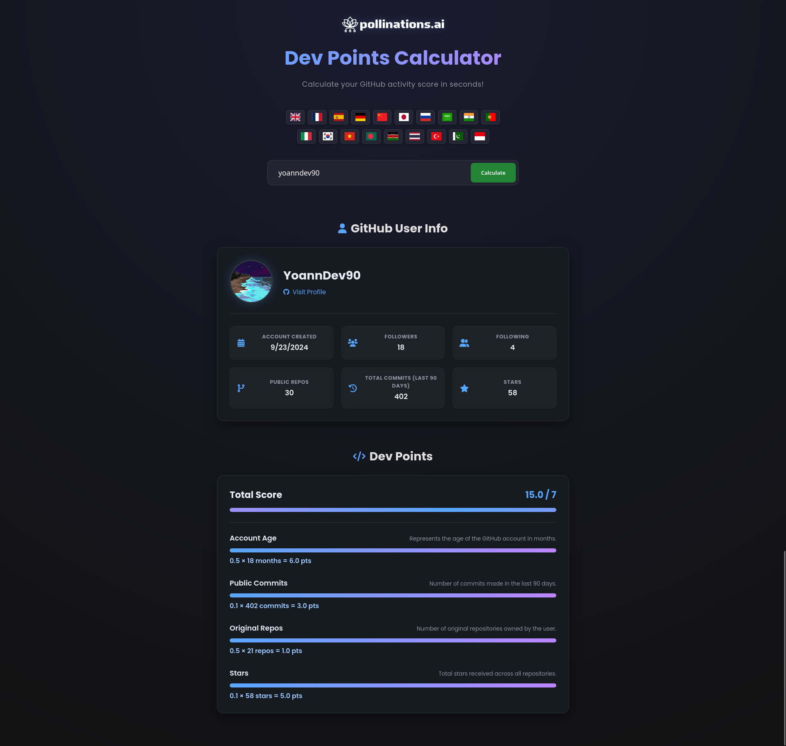

# Pollinations Seed Tier Dev Points

This project calculates Pollinations Dev Points based on GitHub usernames. It uses the GitHub API to fetch user data and displays the results in a modern web interface.

## Features
- Calculate Dev Points based on GitHub activity.
- Display user details such as profile picture, followers, and repositories.
- Multilingual support with translations for 20 languages.
- Dark theme for better user experience.
- Global and individual progress bars for detailed scoring.

## Screenshots



## Installation

1. Clone the repository:
   ```bash
   git clone https://github.com/pollinations/Pollinations-Seed-Tier-Dev-Points.git
   ```

2. Navigate to the project directory:
   ```bash
   cd Pollinations-Seed-Tier-Dev-Points
   ```

3. Start the development server:
   ```bash
   npm run dev
   ```

4. Open your browser and go to:
   ```
   http://localhost:3000
   ```

## Usage

1. Enter a GitHub username in the input field.
2. Click the "Calculate" button.
3. View the user's Dev Points and details.

## Configuration

The application uses a `config.json` file to define scoring parameters. You can customize the scoring system by modifying this file:

```json
{
  "needed_dev_points": 7,
  "account_age_points_per_month": 0.5,
  "public_commits_points_per_commit": 0.1,
  "original_repos_points_per_repo": 0.5,
  "stars_points_per_star": 0.1,
  "max_account_age_points": 6,
  "max_public_commits_points": 3,
  "max_original_repos_points": 1,
  "max_stars_points": 5
}
```

## Translation

To add or update translations:
1. Edit the `langs/en.json` file for English text.
2. Run the `translate_all.sh` script to generate translations for all supported languages:
   ```bash
   bash translate_all.sh
   ```

## Supported Languages
- English (🇬🇧)
- Chinese (🇨🇳)
- Hindi (🇮🇳)
- Spanish (🇪🇸)
- French (🇫🇷)
- Arabic (🇸🇦)
- Bengali (🇧🇩)
- Russian (🇷🇺)
- Portuguese (🇧🇷)
- Urdu (🇵🇰)
- Indonesian (🇮🇩)
- German (🇩🇪)
- Japanese (🇯🇵)
- Swahili (🇹🇿)
- Turkish (🇹🇷)
- Korean (🇰🇷)
- Vietnamese (🇻🇳)
- Italian (🇮🇹)
- Thai (🇹🇭)

## License
This project is licensed under the MIT License. See the `LICENSE` file for details.